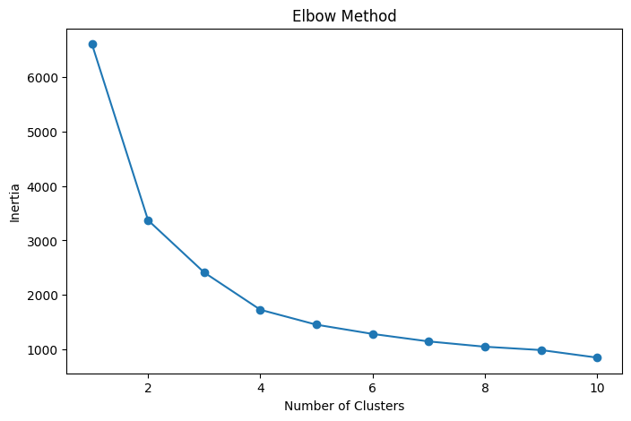
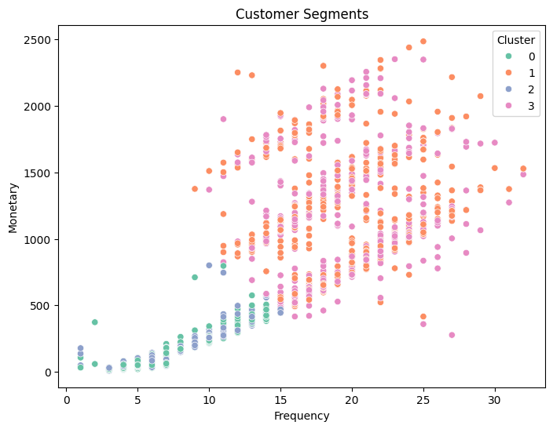
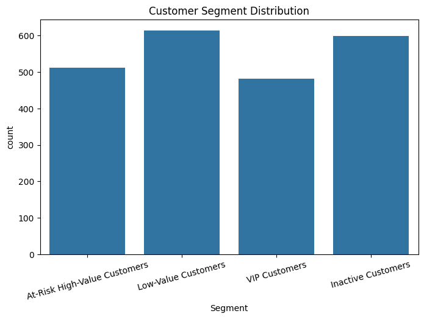
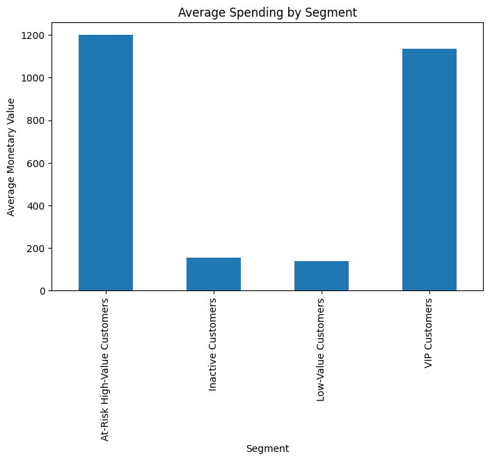
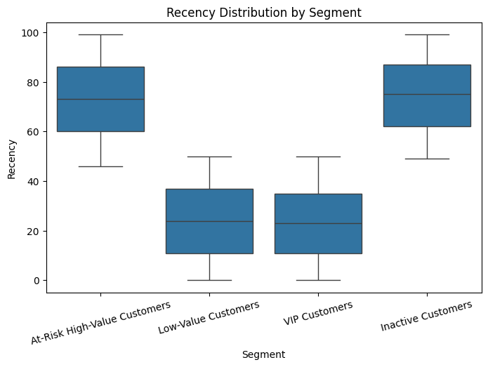

# Customer Segmentation Analysis using RFM and K-Means

## Project Overview
This project explores customer segmentation using RFM (Recency, Frequency, Monetary) analysis and K-Means clustering.

The goal was to understand customer purchasing behaviour and identify:
- high-value customers,
- customers likely to stop purchasing,
- and customer groups that should be targeted differently.

Instead of treating every customer the same way, this analysis helps show where marketing efforts should actually go.

---

## Problem Statement
Businesses often market to all customers the same way, even though customer behaviour differs significantly.

The objective of this project was to group customers based on purchasing patterns and identify:
- customers worth retaining,
- customers at risk of churn,
- and customers with growth potential.

---

## Dataset
### Customer Personality Analysis Dataset

Source:
https://www.kaggle.com/datasets/imakash3011/customer-personality-analysis

The dataset contains:
- Customer demographics
- Purchase history
- Campaign responses
- Spending behaviour
- Web, catalog, and store purchases

---

## Tools & Technologies

| Tool | Purpose |
|---|---|
| Python | Data analysis and modeling |
| Pandas | Data cleaning and manipulation |
| NumPy | Numerical operations |
| Matplotlib | Data visualization |
| Seaborn | Statistical visualization |
| Scikit-learn | K-Means clustering |
| Jupyter Notebook | Project development environment |

---

## Project Workflow

```text
Data Cleaning
    ↓
Feature Engineering
    ↓
RFM Analysis
    ↓
Data Scaling
    ↓
K-Means Clustering
    ↓
Segment Profiling
    ↓
Data Visualization
    ↓
Business Insights & Recommendations
```

---

## Data Cleaning
The dataset required preprocessing before clustering.

The following steps were performed:
- Removed missing values
- Removed duplicate records
- Converted date columns
- Handled income and spending outliers
- Created customer age feature
- Engineered RFM metrics

---

## RFM Analysis

### What is RFM?

| Metric | Meaning |
|---|---|
| Recency | How recently a customer purchased |
| Frequency | How often a customer purchases |
| Monetary | How much money a customer spends |

RFM analysis helps businesses identify valuable customers based on purchasing behaviour.

---

## K-Means Clustering
K-Means clustering was used to group customers with similar purchasing patterns.

The Elbow Method was applied to determine the optimal number of clusters.

---

## Customer Segments

| Segment | Characteristics | Business Goal |
|---|---|---|
| VIP Customers | High spending and frequent purchases | Retain and reward |
| At-Risk High-Value Customers | Previously active but not purchasing recently | Re-engage and retain |
| Low-Value Customers | Low spending and low purchase frequency | Increase customer value |
| Inactive Customers | Low engagement and minimal purchases | Reactivate interest |

---

## Visualizations & Insights

| Visualization | Purpose |
|---|---|
| Elbow Method Plot | Determine optimal number of clusters |
| Cluster Scatter Plot | Visualize customer groups |
| Segment Distribution Chart | Show number of customers per segment |
| Spending by Segment | Compare customer monetary contribution |
| Recency Distribution | Analyze customer engagement |


## 1. Elbow Method Plot



### Insight
The Elbow Method was used to identify the optimal number of clusters for K-Means segmentation.

The curve started flattening around 4 clusters, suggesting that customer behaviour could be grouped effectively into four distinct segments without adding unnecessary complexity.

---

## 2. Customer Cluster Plot



### Insight
The cluster plot shows clear differences in customer spending and purchasing frequency.

VIP Customers appeared concentrated in the high-frequency and high-spending region, while inactive and low-value customers were grouped around lower purchasing activity.

---

## 3. Customer Segment Distribution



### Insight
The segment distribution chart helped show how customers were spread across the four clusters.

Most customers belonged to the low-value and inactive segments, while VIP Customers represented a smaller but more valuable group.

---

## 4. Average Spending by Segment



### Insight
VIP Customers contributed the highest average spending compared to other segments.

This suggests that retaining high-value customers could have a significant impact on overall revenue.

---

## 5. Recency Distribution by Segment



### Insight
The recency distribution showed that inactive and at-risk customers had not purchased recently, while VIP Customers remained more actively engaged.

This can help businesses identify which customer groups may require retention or reactivation campaigns.
---

## Key Insights
- VIP Customers had the highest spending and purchase frequency.
- At-Risk High-Value Customers were previously active but had not purchased recently.
- Low-Value Customers purchased recently but spent less overall.
- Inactive Customers showed low engagement across most purchasing activities.

---

## Marketing Recommendations

### VIP Customers
- Loyalty rewards
- Exclusive offers
- Premium membership programs

### At-Risk High-Value Customers
- Personalized email campaigns
- Win-back promotions
- Limited-time discounts

### Low-Value Customers
- Upselling strategies
- Cross-selling recommendations
- Repeat purchase incentives

### Inactive Customers
- Reactivation campaigns
- Introductory discounts
- Promotional campaigns

---

## Value of Customer Segmentation
Customer segmentation helps businesses:
- Understand different customer behaviours
- Send more relevant marketing campaigns
- Focus marketing budget on customers most likely to respond
- Improve retention strategies
- Identify high-value customer groups

---

## Challenges Faced
One challenge was handling outliers in customer income and spending data, which affected clustering quality.

To improve segmentation performance, outliers were filtered before applying K-Means clustering.

Another challenge was selecting the optimal number of clusters. The Elbow Method was used to identify a suitable cluster count for segmentation.

---

## Project Structure

```text
customer-segmentation-rfm-kmeans/
│
├── visuals/
├── README.md/
├── dataset/
├── python file/
```

---

## Project Outcome
This project demonstrates how machine learning and customer analytics can be used to group customers based on purchasing behaviour and support more focused marketing decisions using customer data.
